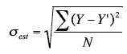

# Linear Regression

Linear regression quantifies the relationship between one or more predictor variables and one outcome variable by linear means.

Linear regression is used for predictive analysis and modeling. 

For example, linear regression can be used to quantify the relative impacts of age, gender, and diet (the predictor variables) on height (the outcome variable).

```
y = mx + c

where
c = y-intercept (value of y when x=0)
m = slope
```

## sample data

|X|Y|
|-|-|
|1.00|	1.00|
|2.00	|2.00|
|3.00	|1.30|
|4.00	|3.75|
|5.00	|2.25|


Linear regression consists of finding the best-fitting straight line through the points. The best-fitting line is called a **regression line**.

## The Best fitting line

The best-fitting line is the line that minimizes the sum of the squared errors of prediction.


The vertical lines from the points to the regression line represent the errors of prediction. As you can see, the red point is very near the regression line; its error of prediction is small. By contrast, the yellow point is much higher than the regression line and therefore its error of prediction is large.

## Least Squared Method

The least squares method is a form of mathematical regression analysis that finds the line of best fit for a set of data, providing a visual demonstration of the relationship between the data points.


## Standard Error of Estimation

The standard error of the estimate is a measure of the accuracy of predictions. 

**Recall** that the regression line is the line that minimizes the sum of squared deviations of prediction (also called the sum of squares error).

In Graph A, the points are closer to the line than they are in Graph B. Therefore, the predictions in Graph A are more accurate than in Graph B.




σest is the standard error of the estimate,Y is an actual score, Y' is a predicted score, N is the number of pairs of scores.

## Reference
http://onlinestatbook.com/
