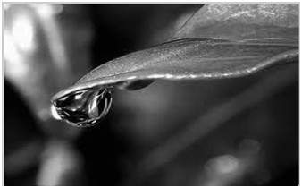

# Color Image to Gray Scale Conversion

Now we will convert a color image into gray scale image.

There are two methods for doing this.

- Average Method
- Weighted method or luminosity method

## Average Method

This is simple method. Each pixel has R, G and B value.
Add three values and divide by 3.

```js
GrayScale = (R+G+B)/3
```


It works! But something happens. Our image similars to a black image rather than a gray-scale image. **Why?**

3 different colors have different wavelengths & have their own contribution to the image. Thus, we have to average contribution of each color to image. Not average of the total.

What we have done is 
```
33% red, 33% green, 33% blue
```
Taking every color has same contribution to image.

## Weighted method or luminosity method

The problem to average method has been solved by weighted method.

For colors, Red color has more wavelength than others. Green is the most smoothing color to the eye.

That means Red color contribution must be decreased, Green color must be increased and blue color must be adjusted based on two colors.

```js
New grayscale image = ( (0.3 * R) + (0.59 * G) + (0.11 * B) )
```
According to this equation, Red has contribute 30%, Green has contributed 59% which is greater in all three colors and Blue has contributed 11%.




Compare Two Images of two methods


### Which is better?