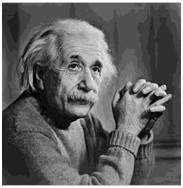

# Gray Level Resolution

Gray level resolution refers to the predictable or deterministic change in the shades or levels of gray in an image.

Confuse?

Simply, gray level resolution refers to the number of bits per pixel (bpp). 

Remember bpp?

Bpp value means the number of available colors of an image.

```js
Gray Level Resolution = 2^bpp
```


This image is an gray-scale image. Thus, it is bpp is 8 and Gray Level Resolution is 256. 

## Contouring

If we reduce the gray scale level of image, we will see a special effect.


*256 Level*

 
*16 Level*

When compare two photos, we can see obviously special effects (some false colors, or edges) in 16 Level than original 256 Level.
This feature is called **contouring**.
The answer to this effect lies in iso-preference curves.