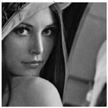
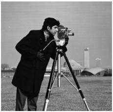
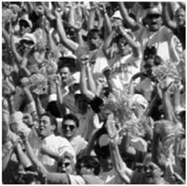
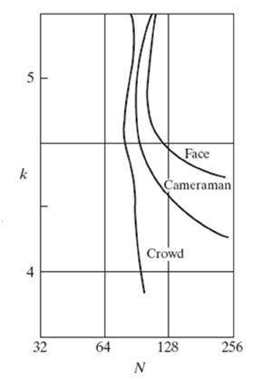

# Isoperference curves

The nature of Isopreference curves shows that contouring effect not only depends on decreasing the gray scale level but also on the image details.

If an image has **more detail**, the effect of contouring would start appear on this image **later**, as compare to an image which has less detail, when the gray levels are descreasd on gray-scale level.

According to the original research, the researchers took these three images and they vary the Gray level resolution, in all three images.

First image is least detailed since it contains a face. Second is less detailed than third. But third image is most detailed since it contains lots of people.

## Experiment

The gray level was varied on all images and ask audience to rate the images. After rating, result came out as graph.

N = number of gray level,
k = bits per pixel

The point of interest is that isopreference curve seems to be more vertical in more-detailed image.
That means, less-detaied images are more suspcetable to contouring.