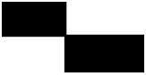
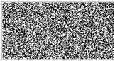
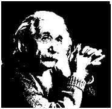
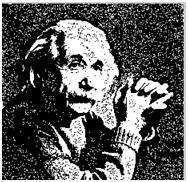

# Dithering

Dithering is the process by which we create illusions of the color that are not present actually. It is done by the random arrangement of pixels.

Compare two images. They have same quantity of pixel but different arrangement of pixels.

## Why Dithering?

To get more slight image.

## Preforming Process

First we will work on thresholding. In thresholding, we take a constant value. All pixels that are above constant value are set as white(1) and below are black(0).

After that, we got a black and white image. But it is not so slight to see. We perform some random dithering effect on this B&W image.

Now we got slighter image by random dithering.