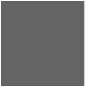

# Brightness & Contrast

## Brightness

Brightness can be defined as energy outputs of sources of light when comparing things. Thus, it is relative property.

### Increase brightness of an image

This is a black image.


This is matrix of a black image.
||||
|-|-|-|
|0|0|0|
|0|0|0|
|0|0|0|

Now, add 100 to each pixel of the black image.
||||
|-|-|-|
|100|100|100|
|100|100|100|
|100|100|100|

Compare original and result image




Though we change pixels, what result is change in brightness.
The real working process is that pixel value is gradaully increased into white.

## Contrast

Contrast is simply defined as difference between maximum and minimum pixel values of an image.

||||
|-|-|-|
|100|100|100|
|100|100|100|
|100|100|100|

For this image, 
```js
contrast = 100 - 100
         = 0
```

Thus, this image has contrast 0.