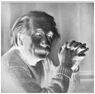
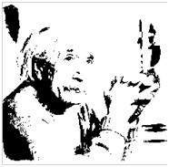

# Image Transformation

Transformation is a function that convert a set of input into a set of output.

Image Transformation is a function that convert input image into output image.
```javascript
output = Trasformer(input);
```
**where**

input = pixel value of input image at position (x,y)

output = pixel value of output image at position (x,y)

## Gray Level Transformation

### Image enhancement

An enhanced image provides better contrast and more detailed than a non-enhanced image. 
It has lots of applications.
- Medical Image enhancement
- Satellite Image enhancement
- Sensor Image enhancement

Image enhancement can be done with gray level transformation.
- Linear
- Lograthimic
- Power - law

### Linear Transformation

It has two parts : simple identity and negative transformation.

**Simple Identity Transformation**

It is transformation that each pixel of image as direct ouput. Input and output images are the same.

**Negative Transformation**

It is a function that each value of image is subtracted from (L-1) and mapped as output.
```js
output = (L-1) - input
```
where
L is the number of gray-scale level of image.




Since original image is a gray-scale image, bpp = 8
L = 2^8 = 256;

output = (256-1)-input

Lighter pixel becomes dark and darker pixel becomes light.
Thus it is called negative transformation.

### Lograthimic Transformation

It also contains two types : Log transformation and Inverse Log Transformation

**Log Transformation**

```js
output = c log(input+1)
```
where c = constant
1 is added because when input is 0, log 0 would be infinity.
Therefore log 1 is 0.

Dark pixels are expanded into larger values & Larger values compressed into lograthmic value. c is the value of enhancement.




Inverse log transformation is opposite to log transform.

### Power-Law Transformation

```js
output = (c*input)^γ
```

γ is called gamma and hence this transformation is called gamma ransformation. The gamma of different display devices is different. That's why different devices show images at their own enhancement.