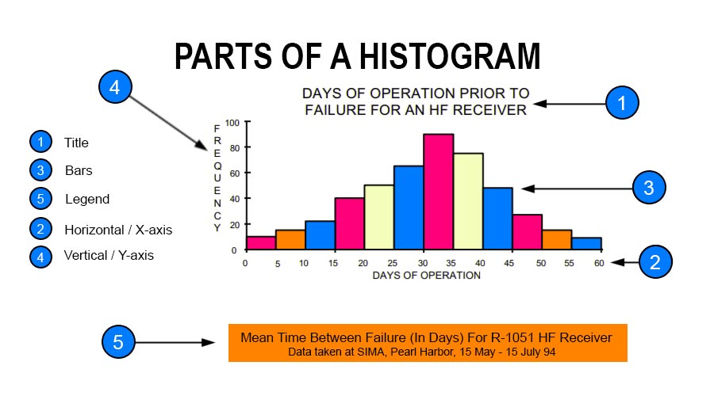
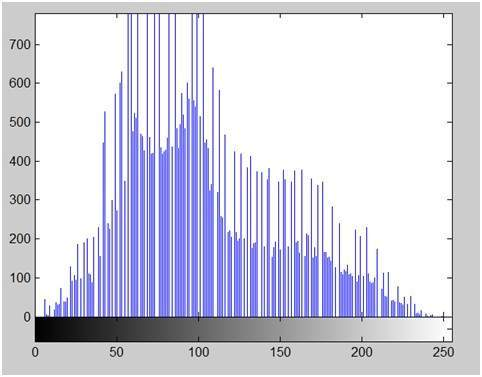
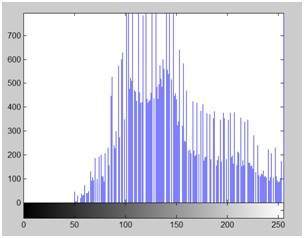
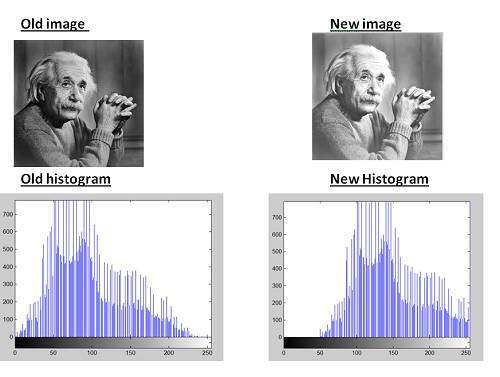

# Histrogram

Histrogram is a graph that shows frequency of anything.

A hsitrogram usually contains x and y axis.
X is the whose frequency and Y is frequency.



## Histogram of an image

Image histrogram also shows frequency but it shows frequencies of pixel values.


The histrogram of above eistein picture is below.


Histrogram has many uses in image processing. For example,
- brightness and contrast
- equalizing the image
- computer vision

## Histrogram Sliding

Histrogram sliding is shifing a complete histrogram leftwards or rightwards. Due to shifting, clear changes in image can be seen.

For example,

shift right to 50 pixels will increase the brightness. Our image has highest frequency between 50 and 100. Shifting 50 pixels to right means add 50 to each pixel. Now, hight frequency will occcurs between 100 and 150.



And compare the two images.


Shifting left will decrease brightness.

## Histrogram Streching & Equalization

We have discuss about brightness which is histrogram shifting. Histrograms can also be used for changing contrast. There are two ways of performing constrast on image histrogram.
One is **Histrogram stretching** & another is **Histrogram equalization**.

### Contrast
Contrast is the difference between maximum and minimum pixel intensity. For einstein iamge, contrast is 255.

### Histrogram Stretching

Now, we will increase the contrast of image.
```js
output = [(input- min pixel)/contrast] * gray level
gray level = 2^bpp
```

For einstein, min pixel = 0, contrast = 255, gray level = 256
Thus 
```js
output ~ input
```
So no contrast effect would occurs here.
This is the failure of histrogrm streching.