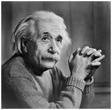

# Histogram Equalization

In this chapter, we will see how to contrast with histogram equalization. In this case, histogram is not always not need for contrast. In some cases, histogram is worse for contrast. 

From Last chapter, in histogram equalization, first and second steps are PMF and CDF. As the name implies, we have to eqaulize every pixel of image. PMF helps us calculating the probability of each pixel. CDF gives us cumulative sum of these values.

Calculate CDF according to the gray scale level.

|Gray Level Value|	CDF|
|----------------|-|
|0|	0.11|
|1	|0.22|
|2	|0.55|
|3	|0.66|
|4	|0.77|
|5	|0.88|
|6	|0.99|
|7	|1|

Next Step is to multiply CDF values with (Gray Level - 1).
Consider we have 3bbp image, then Gray Level is 8.

|Gray Level Value|	CDF| CDF*(Gray Level -1)
|----------------|-|-|
|0|	0.11|0|
|1	|0.22|1|
|2	|0.55|3|
|3	|0.66|4|
|4	|0.77|5|
|5	|0.88|6|
|6	|0.99|6|
|7	|1|7|

Then map old value to new value. 0 to 0, 1 to 1, 2 to 3,etc.

There is also one important thing to be note here that during histogram equalization the overall shape of the histogram changes, where as in histogram stretching the overall shape of histogram remains same.