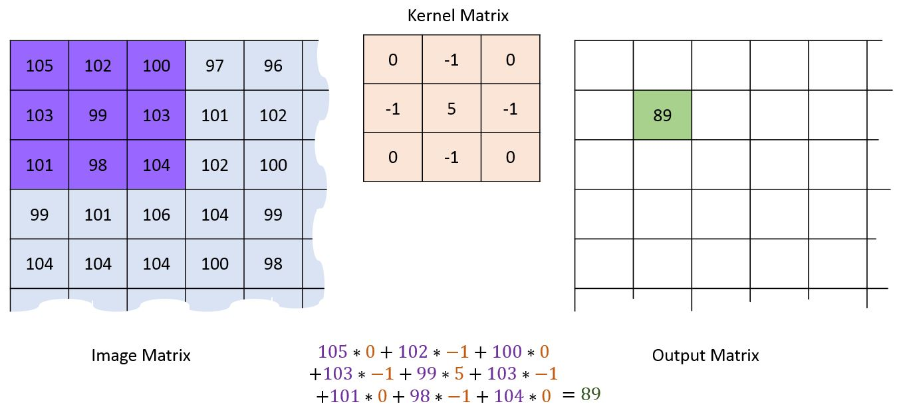

# Convolution 

Where have we been?

We have find two different ways of manipulation. 
- Transformation
- Histogram

Another way of dealing image is **convolution**.

Convolution is the process of adding each element of the image to its local neighbors, weighted by the kernel. *(wikipedia)*

Each convolution operation has a kernel which could be a any matrix smaller than the original image in height and width. (http://machinelearninguru.com)

## Convolution Process

In order to perform convolution on an image, following steps should be taken.

- Flip the kernel both horizontally and vertically. As our selected kernel is symetric, the flipped kernel is equal to the original.
- Put the first element of the kernel at every pixel of the image (element of the image matrix). Then each element of the kernel will stand on top of an element of the image matrix.

- Multiply each element of the kernel with its corresponding element of the image matrix (the one which is overlapped with it)
- Sum up all product outputs and put the result at the same position in the output matrix as the center of kernel in image matrix.
- 

- For the pixels on the border of image matrix, some elements of the kernel might stands out of the image matrix and therefore does not have any corresponding element from the image matrix. In this case, you can eliminate the convolution operation for these position which end up an output matrix smaller than the input (image matrix) or we can apply padding to the input matrix (based on the size of the kernel we might need one or more pixels padding, in our example we just need 1 pixel padding):

Why Convolution
Convolution can achieve something, that the previous two methods of manipulating images can’t achieve. Those include the blurring, sharpening, edge detection, noise reduction e.t.c.

## List of common kernels

https://en.wikipedia.org/wiki/Kernel_(image_processing)#Details

Reference & Images of this chapter
http://machinelearninguru.com/computer_vision/basics/convolution/image_convolution_1.html