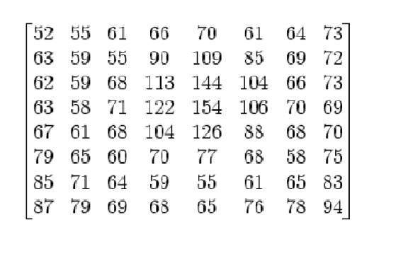
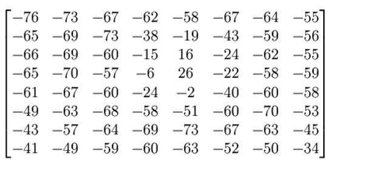
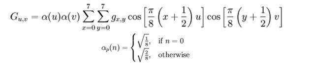
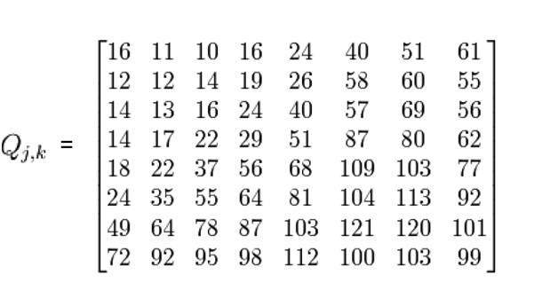
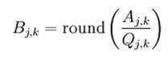

# JPEG Compression

JPEG - Joint Photography Experts Group

## Image compression

Image compression is the method of data compression on digital images. Purpose is to store and transmit data efficiently.

JPEG compression is one of the first methods used in image compression. It could be lossy as well as lossless .

## Working Process

Firstly, divide an image into blocks of 8x8 dimensions.

We will subtract 128 from each pixel. 

We will compute using this formula.

The result comes from this is stored in let’s say A(j,k) matrix.

There is a standard matrix that is used for computing JPEG compression, which is given by a matrix called as Luminance matrix.

### Luminance matrix

Then, we will apply this formula.

### Entropy coding

Entropy coding is a special form of lossless data compression. It involves arranging the image components in a "zigzag" order employing run-length encoding (RLE) algorithm that groups similar frequencies together, inserting length coding zeros, and then using Huffman coding on what is left.

Zigzag ordering of JPEG image components

−26		

−3	0

−3	−2	−6

 2	−4	1	−3

 1	1	5	1	2

−1	1	−1	2	0	0

 0	0	0	−1	−1	0	0

 0	0	0	0	0	0	0	0

 0	0	0	0	0	0	0

 0	0	0	0	0	0

 0 	0	0	0	0

 0	0	0	0

 0	0	0

 0	0

 0

This chapter takes reference from https://en.wikipedia.org/wiki/JPEG#JPEG_compression.