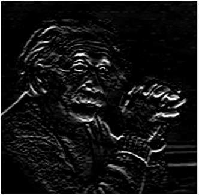

# Prewitt Operator

Prewitt Operator is used for image processing.

It detects two types of edges : horizontal & vertical.

## Process

Edges are calculated by using difference between corresponding pixel intensities of an image. Since images are signals, changes in signals or pixels can be calculated by differentiation. Thus, these operators are called Dertivative Operator.

All derative operators follow 3 properties.

1. Opposite sign should be present in the mask.
2. Sum of mask should be equal to zero.
3. More weight means more edge detection. (Weight = Center element)

Prewitt operator provides us two masks one for detecting edges in horizontal direction and another for detecting edges in an vertical direction.

### Vertical edge detecting kernels

|||||
|-|-|-|-|
|-1	|0|	1|
|-1	|0	|1|
|-1	|0	|1|

As the center column is of zero so it does not include the original values of an image but rather it calculates the difference of right and left pixel values around that edge.

### Horizontal edge detecting kernels

|||||
|-|-|-|-|
|-1	|-1	|-1|
|0	|0	|0|
|1	|1	|1|

It works as the same principle with vertical.

When apply,

### Vertical Edge Detection

### Horizontal Edge Detection

By comparing two images, we can get edges.