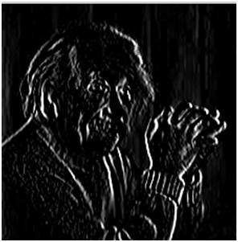
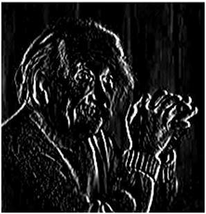

# Sobel Operator

It is very similar to Prewitt Operator.

In sobel operator the coefficients of masks are not fixed(same) and they can be adjusted according to our requirement unless they do not violate any property of derivative masks.

## Vertical Edge Kernel

|||||
|-|-|-|-|
|-1	|0|	1|
|-2	|0	|2|
|-1	|0	|1|

This mask works exactly same as the Prewitt operator vertical mask. There is only one difference that is it has “2” and “-2” values in center of first and third column. When applied on an image this mask will highlight the vertical edges.

This give more weight age to the pixel values around the edge region. This increase the edge intensity and it become enhanced comparatively to the original image.

## Horizontal Mask of Sobel Operator

|||||
|-|-|-|-|
|-1	|-2	|-1|
|0	|0	|0|
|1	|2	|1|

## Comparison between Prewitt & Sobel Operators

First image is Prewitt Vertical & second is Sobel Vertical.

Sobel operator finds more edges or make edges more visible as compared to Prewitt Operator.
This is because in sobel operator we have allotted more weight to the pixel intensities around the edges.

### Adding More Weights

|||||
|-|-|-|-|
|-1	|0|	1|
|-5	|0	|5|
|-1	|0	|1|

Applying more weight will give more edges.