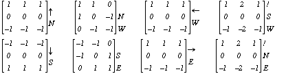

# RobinSon Compass Mask

As the name, it is an edge detector that can work in all major 8 directions in compass.

- North
- North West
- West
- South West
- South
- South East
- East
- North East

## Process

Take one Sobel or Prewitt Operator. Rotate the Mask.

### North Direction
|||||
|-|-|-|-|
|-1	|0|	1|
|-2	|0	|2|
|-1	|0	|1|

### North West Direction
|||||
|-|-|-|-|
|0	|1|	2|
|-1	|0	|1|
|-2	|-1	|0|

###  West Direction
|||||
|-|-|-|-|
|1	|2|	1|
|0	|0	|0|
|-1	|-2	|-1|

This is Horizontal edge mask.

Suppose there is an image, which do not have any North East direction edges so then that mask will be ineffective.