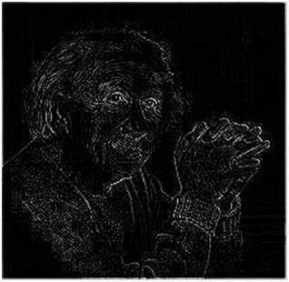
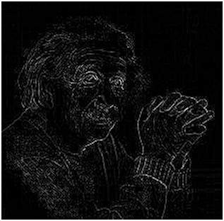

# Laplacian Operator

Unlike other operators, laplacian operator is second order derivative. It can be classified into two types. 

- Positive Operator
- Negative Operator

Laplacian does not take out edges in direction. It takes out edges as **inward** and **outward**.

## Positive Laplacian Operator

Center element must be negative and corner elements must be zero.

||||
|-|-|-|
|0	|1|	0|
|1|	-4|	1|
|0	|1	|0|

This takes outward edges.

## Negative Laplacian Operator

Center must be positive, all corners must be zero and all other elements must be negative.

||||
|-|-|-|
|0	|-1|	0|
|-1|	4|	-1|
|0	|-1	|0|

## How it works

Laplacian is a derivative operator; its uses highlight gray level discontinuities in an image and try to deemphasize regions with slowly varying gray levels. This operation in result produces such images which have grayish edge lines and other discontinuities on a dark background. This produces inward and outward edges in an image

The important thing is how to apply these filters onto image. Remember we can’t apply both the positive and negative Laplacian operator on the same image. we have to apply just one but the thing to remember is that if we apply positive Laplacian operator on the image then we subtract the resultant image from the original image to get the sharpened image. Similarly if we apply negative Laplacian operator then we have to add the resultant image onto original image to get the sharpened image.

### Positive Laplacian Op

### Negative Laplacian Op

Reference : https://www.tutorialspoint.com/dip/laplacian_operator.htm