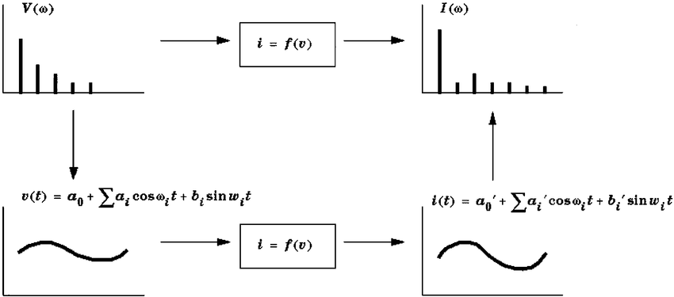

# Frequency Domain Analysis

We have manipulate in many ways. 
- Transformation
- Histrogram
- Convolution

Now we will see Frequency Domain Analysis.

In frequency domain analysis, we analyze signals with respect to frequency.

## How?

First, we transform an image into its frequency distribution. It will be processed into a transformation. After performing inverse transformation, it will back into the normal image.

## Transform

A signal can be converted between the time and frequency domains with a pair of mathematical operators called a transform.

### Some common transfroms

- Fourier Series
- Fourier transformation
- Laplace transform
- Z transform

### High frequency components
High frequency components correspond to edges in an image.

### Low frequency components
Low frequency components in an image correspond to smooth regions.