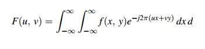
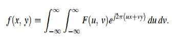

# Fourier Series & Transform

## Fourier

Fourier was a mathematician in 1822. He give Fourier series and Fourier transform to convert a signal into frequency domain.

## Fourier Series

Fourier series simply states that, periodic signals can be represented into sum of sines and cosines when multiplied with a certain weight. It further states that periodic signals can be broken down into further signals with the following properties.

The signals are sines and cosines
The signals are harmonics of each other

## How?

To perform image in frequency domain, we must first convert it into frequency domain and takes inverse of output to convert it back into spatial domain.

### formula

### Inverse formula

## Fourier transform

The Fourier transform simply states that that the non periodic signals whose area under the curve is finite can also be represented into integrals of the sines and cosines after being multiplied by a certain weight.

The Fourier transform has many wide applications that include, image compression (e.g JPEG compression), filtering and image analysis.

## Difference between Fourier series and transform

Although both Fourier series and Fourier transform are given by Fourier , but the difference between them is Fourier series is applied on periodic signals and Fourier transform is applied for non periodic signals.

## Which one is applied on images?

Now the question is that which one is applied on the images , the Fourier series or the Fourier transform. Well, the answer to this question lies in the fact that what images are. Images are non – periodic. And since the images are non periodic, so Fourier transform is used to convert them into frequency domain.

